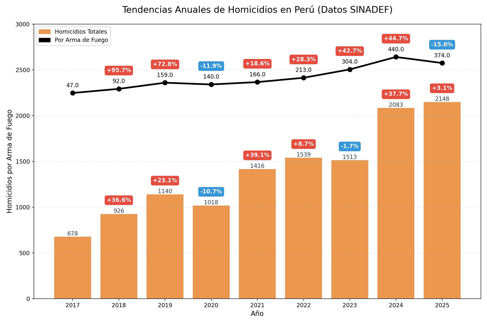

# sinadef-analysis

ETL pipeline for analyzing Peru death records from SINADEF (Sistema Informático Nacional de Defunciones). Downloads 600MB+ dataset from MINSA, categorizes homicides by weapon type using DuckDB SQL queries, and uploads results to Google Cloud Storage.

## Dashboard

📊 **[View Interactive Dashboard →](https://lookerstudio.google.com/reporting/60c8a004-b760-427d-a44f-a1d1990bad0d/page/5fQjF)**

The dashboard displays daily processed homicide data from this ETL pipeline, updated automatically.



## Overview

**Data Source**: [MINSA - SINADEF Datos Abiertos](https://www.datosabiertos.gob.pe/dataset/informaci%C3%B3n-de-fallecidos-del-sistema-inform%C3%A1tico-nacional-de-defunciones-sinadef-ministerio)

**Pipeline**:
- **Extract**: Downloads CSV from MINSA (1M+ rows, ~600MB) with Cloudflare bypass handling
- **Transform**: DuckDB SQL queries to clean and categorize homicides by:
  - Gunshot wounds (PAF - Proyectil de Arma de Fuego)
  - Knife/stabbing (Arma blanca, punzocortante)
  - Blunt force (Contusión, contundente)
  - Organ failure/hemorrhage (Shock hipovolémico, hemorragia aguda)
- **Load**: Save locally and upload to GCS with automatic authentication

**Technologies**: Pandas, DuckDB, PyArrow, Google Cloud Storage, Requests

## Structure

```
sinadef-analysis/
├── src/                    # Python source code
│   ├── pipeline.py         # Main ETL logic (extract-transform-load)
│   ├── transforms.py       # DuckDB SQL queries for data transformation
│   └── utils.py            # GCS upload utility with authentication
├── resources/              # Configuration files
│   └── config.yaml         # ETL configuration (schedule, compute, paths)
├── tests/                  # Unit tests
│   └── test_pipeline.py
├── pyproject.toml          # Poetry dependencies
└── Dockerfile              # Multi-stage container with non-root user
```

## Local Development

### Install dependencies
```bash
poetry install
```

### Run ETL locally
```bash
poetry run poe run
```

### Run tests
```bash
poetry run poe test
```

### Lint code
```bash
poetry run poe ruff
```

## Configuration

Edit `resources/config.yaml` to configure:
- **Schedule**: `"0 9 * * *"` - Daily at 8am UTC (9am in config)
- **Compute**: 4 CPU, 16Gi memory, 1 hour timeout
- **Input**: MINSA CSV URL (https://files.minsa.gob.pe/...)
- **Output**: GCS path with Jinja2 template - `gs://{{ GCP_BUCKET }}/data/homicidios_detallado.csv`
- **Retry**: 2 retries with 5-minute exponential backoff

**Environment Variables**:
- `GCP_BUCKET`: Target bucket name (rendered at pipeline compilation time)

## Deployment

Deploy via GitHub Actions:
1. Go to Actions tab in GitHub
2. Select "Deploy ETL to Vertex AI"
3. Click "Run workflow"
4. Select **`sinadef-analysis`** and environment (dev/prod)
5. Approve deployment (owner only)

**Prerequisites**:
- Set `GCP_BUCKET` repository variable in GitHub
- Ensure service account has `storage.admin` role
- Workload Identity configured for Vertex AI

**Output**: Results uploaded to `gs://{GCP_BUCKET}/data/homicidios_detallado.csv`
